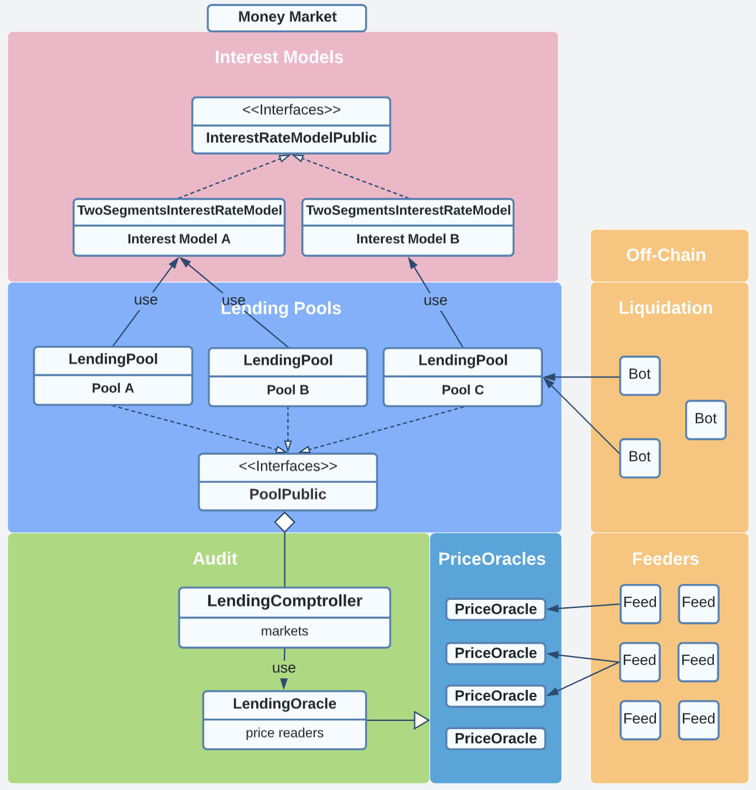

# 💰 Decentralized Money Market

This is a pool-based, algorithmically-set interest rate, decentralized money market for fungible tokens on Flow blockchain. It aggregates user supplied funds into smart contracts, any deposited fungible tokens are also used as collaterals for borrowing other fungible tokens.
## 🧩 Project Overview
<p>
    <a href="https://increment.gitbook.io/public-documentation-1/protocols/decentralized-money-market">
        
    </a>
</p>
<br>

## 📖 Directory Layout
```js
├── contracts
│   ├── LendingConfig.cdc                       /* Common paths and constants */
│   ├── LendingError.cdc                        /* Error codes */
│   ├── LendingInterfaces.cdc                   /* All public resource interfaces */
│   ├── TwoSegmentsInterestRateModel.cdc        /* Basic interest rate model used by the money market */
│   ├── LendingComptroller.cdc                  /* Safety auditing before any side effects were applied to LendingPool */
│   ├── LendingPool.cdc                         /* Each of supported FungibleTokens on the money market has a corresponding LendingPool contract deployed & configured */
│   ├── LendingOracle.cdc                       /* A proxy contract to read from decentralized price feeds and formalize the result using OraclePublic interface */
│   └── SimpleOracle.cdc                        /* A single node oracle only used for unittest purpose */
│
├── scripts
│   ├── InterestRateModel                       /* Query interest rate parameters */
│   ├── Oracle                                  /* Query oracle data */
│   └── Query                                   /* Query LendingPool & user info */
│
└── transactions
    ├── Comptroller
    │   ├── add_market.cdc                      /* Add a new LendingPool to the money market */
    │   ├── config_market.cdc                   /* Configure an existing LendingPool's parameters */
    │   └── init_comptroller.cdc                /* Comptroller initialization */
    ├── InterestRateModel
    │   ├── create_interest_rate_model.cdc      /* Create an interest rate model resource. Each LendingPool could have its own interest rate model */
    │   └── update_model_params.cdc             /* Update parameters of an interest rate model */
    ├── Oracle
    │   ├── add_price_feed.cdc                  /* add new oracle price and :endingPoool mapping */
    │   ├── admin_add_price_feed.cdc            /* Only used for SimpleOracle unittest */
    │   ├── ...                                 /* Only used      ......      unittest */
    │   └── updater_upload_feed_data.cdc        /* Only used for SimpleOracle unittest */
    ├── Pool
    │   ├── init_pool_template.cdc              /* Initialization of each LendingPool */
    │   └── prepare_template_for_pool.cdc       /* Preparation tx before deploying LendingPool contract */
    └── User
        ├── user_borrow_template.cdc            /* Template file for user borrow tx */
        ├── user_deposit_template.cdc           /* Template file for user supply (deposit) tx */
        ├── user_liquidate_template.cdc         /* Template file for liquidation tx */
        ├── user_redeemAll_template.cdc         /* Template file for user redeem all tx */
        ├── user_redeem_template.cdc            /* Template file for user redeem (withdraw) tx */
        ├── user_repayAll_template.cdc          /* Template file for user repay all borrows tx */
        └── user_repay_template.cdc             /* Template file for user repay borrow tx */
```
<br>

## 🛠️ Deployment

#### Dev environment setup (Once):
* [Install flow-cli tool with emulator environment](https://docs.onflow.org/flow-cli/install/)
* Install json parsing tool `jq` by `brew install jq`
* Run `yarn` or `npm install`
* Start emulator by `flow emulator -v`, (use `--persist` flag if want to reuse emulator environment)
* Check and run `./commands/gen-env-keys.sh` several times, basically it performs:
  - Generate {privateKey, publicKey} pair by `flow keys generate --sig-algo=ECDSA_secp256k1`
  - Create emulator deployer accounts (see `flow.json`) by `flow accounts create --key "generated-publicKey" --sig-algo "ECDSA_secp256k1" --signer "emulator-account"`
* Replace emulator deployers' `privateKey` fields in `flow.json` file correspondingly, or simply keep the given json file unchanged, whose {privateKey, publicKey} are listed below:
```
flow keys generate --sig-algo=ECDSA_secp256k1

🔴️ Store private key safely and don't share with anyone! 
Private Key 	 3e173ab34b4629ee8e16ee95a6aacb5f088fc95e53ba28ef0f528bf8bcce51ec 
Public Key 	 95efe052cc2e1be2162cb4c273ab86a4602369536fac60e835c63ee5fc856ad7f6f4d17eb505af54482caac0addeb9b2b24e7b44eb79cb02e19be106c1cbfd4f 
```

### Deploy multipools on emulator:
1. Run `flow emulator -v` to start emulator
2. Run `./tools/deployment/emulator/multipool-deploy.sh` to deploy accounts and contracts.
3. Run `./tools/deployment/emulator/multipool-test.sh` for testing.
   <br>or Run `python ./tools/testbot/UserRandomEmulator.py 12` for multiple users simulation.
* Pool setting:
  ./tools/emulator/multipool_setting.py can be modified to support various pools.
* Clear tmp codes:
  python ./tools/emulator/gen_tmp_codes.py 1

### Deploy on testnet:
1. Run `python ./tools/deployment/testnet/GenTmpCodes.py` to generate all empty&mixture codes and configs.
2. Run `python ./tools/deployment/testnet/DeployEmptyOnTestnet.py` to deploy empty contracts.
3. Run `python ./tools/deployment/testnet/UndeployTestnet.py` to clear your deployment.
4. Run `python ./tools/deployment/testnet/DeployUnreadableOnTestnet.py` to deploy all the contracts and initializations.

### Deploy on mainnet:
TODO
<br>

## 🔎 Unittest with [flow-js-testing](https://github.com/onflow/flow-js-testing):
* Docs: https://docs.onflow.org/flow-js-testing/
* Testsuite setup: Check examples under ./tests/setup/setup_\<your_testsuite\>.js
* Testsuite development: Check examples under ./tests/test/\<your_testsuite\>.test.js
* Use different emulator port for different testsuites to run test simultaneously.
* **Note**: To get unittest framework work properly, do NOT break transaction & script arguments into multiple lines, until [this issue](https://github.com/onflow/flow-cadut/issues/15) gets fixed.

### Run tests:
* `npm test`

### Testnet Faucet:
* https://testnet-faucet.onflow.org/
